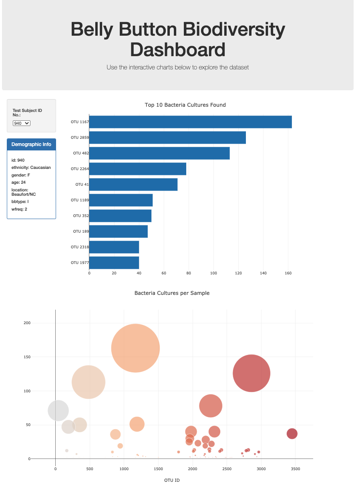

# plotly-challenge

## Description
We have been tasked to build an interactive dashbaord to explore the Belly Button Biodiversity dataset, which catalogs microbes (also known as operational taxonomic units, or OTUs) that colonize human navels. 

## How to Run Code
Clone this repository and open the HTML file or access the web page directly [here](https://shchee5.github.io/plotly-challenge). If the page does not load any information, try clearing your cookies and cache from your browser.

Once on the web page, use the filter under "Test Subject ID No." to select the test subject of your choice. You will find two plots based on the filter, one on top 10 OTUs found in the selected individual and the other on bacteria cultures per sample.

## Results
Here is a preview of what the site looks like:
